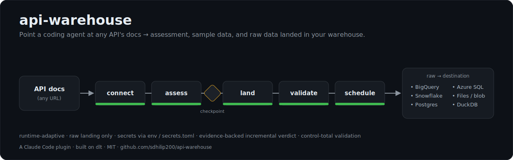

# api-warehouse

[](https://github.com/sdhilip200/api-warehouse/actions/workflows/ci.yml)
[](LICENSE)

> **Point a coding agent at any API's docs → client-ready assessment, sample data, and raw data landed in your warehouse — securely, with validation.**



*One unit of ingestion should make the next one easier. Encode the judgment a senior data engineer applies to a new API — auth, pagination, incremental, validation — so an agent applies it the same way every time.*

---

## Contents

- [Why api-warehouse?](#why-api-warehouse)
- [What you get](#what-you-get)
- [The workflow](#the-workflow)
- [Skill inventory](#skill-inventory)
- [Quick example](#quick-example)
- [Install](#install)
- [Repo structure](#repo-structure)
- [Templates & examples](#templates--examples)
- [Self-checking evals & memory](#self-checking-evals--memory)
- [Security](#security)
- [Scope guard (raw landing only)](#scope-guard-raw-landing-only)
- [Reference docs](#reference-docs)
- [Limitations](#limitations)
- [FAQ](#faq)
- [Contributing](#contributing)
- [License](#license)

---

## Why api-warehouse?

A data engineer handed a new API repeatedly does the same manual work: read the docs, figure out auth, pagination, and incremental support, pull sample data for the client, then build a pipeline that lands raw data in a warehouse and reconcile the numbers. This plugin automates the **discovery + raw-ingestion** half of that job, and stops cleanly at raw landing.

### Positioning vs existing tools

| Tool | What it does | What it leaves to a human |
|------|--------------|--------------------------|
| **dlt** ([dlt-hub/dlt](https://github.com/dlt-hub/dlt), 5k+ stars) | The *load engine*: schema inference, incremental, schema evolution, destinations (BigQuery, Snowflake, Postgres, DuckDB). | **Reading the docs and writing the config** (base URL, auth, pagination, primary key, cursor). `dlt-init-openapi` only works from machine-readable OpenAPI — not from HTML-only docs. |
| **printing-press** | Generates an agent-native CLI + MCP to *call* an API from any spec/site/HAR. | Not a warehouse-landing pipeline; no schema-evolving incremental load; no DE assessment/validation deliverable. |
| **api-warehouse** (this) | The **brain** that reads *human* API docs and produces the config dlt makes you hand-write, **plus** the data-engineering deliverables no other tool packages. | Transformation and downstream modeling — deliberately out of scope. |

**The edge is not "connect to any API"** (printing-press already does that). It is the **data-engineering deliverable**: assessment + sample + validated raw landing.

---

## What you get

1. A **client-ready API Assessment report** (endpoints, auth, pagination, evidence-backed incremental verdict, rate limits, volume estimate).
2. **Sample data** rows for client sign-off.
3. A **dlt raw-landing pipeline** into your chosen destination (DuckDB, Postgres, BigQuery, Snowflake, Azure SQL, files/blob).
4. A **validation / control-total report** reconciling source vs loaded data (row counts, numeric sums, distinct categories, timestamp ranges).
5. A **deploy-ready bundle** for scheduling on Cloud Run, Azure Container Apps, or AWS ECS.

---

## The workflow

```
API docs URL or pasted docs
          │
          ▼
  [connect]    secure auth setup (env vars / .dlt/secrets.toml) + smoke test
          │
          ▼
  [assess]     probe endpoints; detect incremental support (evidence-backed);
          │    estimate volume; pull sample rows
          │    → assessment.html + endpoints.json + samples/*.json
          ▼
  [checkpoint] present the report; confirm intent (one-time vs incremental,
          │    which endpoints, destination) before any data moves
          ▼
  [land]       build a dlt pipeline from endpoints.json; load RAW data
          │    → pipeline code + raw tables in your destination
          ▼
  [validate]   reconcile source vs loaded (control totals) → validation.html
          │
          ▼
  [schedule]   package a deploy-ready Dockerfile + per-platform deploy steps
               → deploy/ bundle (Cloud Run / Azure / ECS)
```

---

## Skill inventory

Each skill is a folder under `skills/` with a `SKILL.md` (instructions), an `EVALS.md` (objective self-checks), and a `MEMORY.md` (API-specific quirks learned over time).

| Skill | Purpose | Key output |
|-------|---------|------------|
| `/api-warehouse` | **Orchestrator** — runs the whole loop with the checkpoint pause | all of the below |
| `/connect` | Secure auth setup (env var / `secrets.toml`) + reachability smoke test | connectivity verdict |
| `/assess` | Read the docs: endpoints, auth, pagination, evidence-backed incremental verdict; pull samples | `assessment.html`, `endpoints.json`, `samples/` |
| `/land` | Generate and run a dlt pipeline; land raw data (raw only, no transforms) | pipeline code + raw tables |
| `/validate` | Best-effort control-total reconciliation (rows, sums, distincts, ranges) | `validation.html` |
| `/schedule` | Package a deploy-ready bundle (Dockerfile + `.dockerignore` + per-platform steps) | `deploy/` bundle |

---

## Quick example

**Full loop, end to end** (uses the public, no-auth JSONPlaceholder API):

```
/api-warehouse https://jsonplaceholder.typicode.com
```

The orchestrator runs `connect → assess`, pauses at the checkpoint so you can read `assessment.html` and confirm scope, then runs `land → validate → schedule`.

**Just an assessment to send a client** (no data moved):

```
/assess https://developer.example.com/api/docs
```

**Land specific endpoints into a warehouse:**

```
/land orders,customers --destination snowflake
```

**Validate a load you already ran:**

```
/validate
```

**Package the pipeline for a daily schedule:**

```
/schedule
```

---

## Install

### Claude Code

```text
/plugin marketplace add https://github.com/sdhilip200/api-warehouse
/plugin install api-warehouse
```

**Prerequisites for the `land` / `validate` steps** (the `connect` / `assess` steps need nothing extra):

```bash
pip install "dlt[duckdb]"          # local default; add bigquery/snowflake/postgres extras as needed
# the skills import the bundled api_warehouse/ library — install it from the repo:
pip install "git+https://github.com/sdhilip200/api-warehouse"
```

### Codex

**Codex CLI:**

```bash
codex plugin marketplace add sdhilip200/api-warehouse
codex plugin add api-warehouse@api-warehouse
```

**Codex App:** open **Plugins** → **Add marketplace**, enter Source `sdhilip200/api-warehouse`, Git ref `main`, leave Sparse paths blank, then install **api-warehouse** and restart Codex.

The same `land` / `validate` Python prerequisites above apply. Codex reads [`AGENTS.md`](AGENTS.md) as its instructions file and loads the skills from `skills/`.

### Other agents

The skills are plain Markdown and platform-neutral. Any agent that can read [`AGENTS.md`](AGENTS.md) and load a `skills/` folder (Cursor, Copilot, etc.) can use them — point it at this repository and start from `skills/api-warehouse/SKILL.md`.

### Existing installs (update)

**Claude Code:**

```text
/plugin marketplace update api-warehouse
/plugin update api-warehouse
```

**Codex CLI:**

```bash
codex plugin marketplace upgrade api-warehouse
codex plugin add api-warehouse@api-warehouse
```

---

## Repo structure

```
api-warehouse/
├── .claude-plugin/
│   └── plugin.json              # plugin manifest (name + skills list)
├── skills/                      # one folder per skill: SKILL.md + EVALS.md + MEMORY.md
│   ├── api-warehouse/           #   orchestrator (runs the full loop)
│   ├── connect/
│   ├── assess/
│   ├── land/
│   ├── validate/
│   └── schedule/
├── api_warehouse/               # tested Python library the skills call
│   ├── profile.py               #   dataset profiling
│   ├── reconcile.py             #   control-total reconciliation
│   ├── report.py                #   standalone HTML reports
│   └── pipeline.py              #   build a dlt rest_api config from endpoints.json
├── references/                  # shared knowledge the skills link to
│   ├── auth-patterns.md  pagination-patterns.md  incremental-detection.md
│   ├── destinations.md  security.md
│   └── running-evals.md  anti-slop.md
├── templates/                   # deploy bundle building blocks
│   ├── Dockerfile  .dockerignore
│   └── deploy/{cloud-run,azure-container-apps,aws-ecs}.md
├── examples/
│   └── jsonplaceholder/         # end-to-end worked example
├── tests/                       # pytest suite (CI-enforced) + live e2e
├── docs/superpowers/            # design spec + implementation plan
├── README.md  CONTRIBUTING.md  LICENSE  pyproject.toml
```

---

## Templates & examples

**Deploy templates** (`templates/`) — copied into a `deploy/` bundle by the `/schedule` skill:

- [`templates/Dockerfile`](templates/Dockerfile) — runs `pipeline.py`; secrets injected at runtime, never baked in.
- [`templates/.dockerignore`](templates/.dockerignore) — keeps `.dlt/secrets.toml`, `.env`, and local artifacts out of the image.
- [`templates/deploy/cloud-run.md`](templates/deploy/cloud-run.md) · [`azure-container-apps.md`](templates/deploy/azure-container-apps.md) · [`aws-ecs.md`](templates/deploy/aws-ecs.md) — copy-paste deploy + cron instructions per platform.

**Worked example** (`examples/`):

- [`examples/jsonplaceholder/README.md`](examples/jsonplaceholder/README.md) — full walkthrough that mirrors the automated end-to-end test: assess JSONPlaceholder → land `/posts` into DuckDB → validate, with the expected `endpoints.json` and report outputs.

---

## Self-checking evals & memory

Every skill ships an `EVALS.md` — a short set of **objective pass/fail checks** on its own output — plus a shared self-grading loop defined once in [`references/running-evals.md`](references/running-evals.md): a separate grader agent runs the checks against the artifact and the skill revises until they pass (capped at 5 rounds). This is how a skill catches a broken `endpoints.json` or a half-loaded table instead of handing you something that merely looks right.

Each skill also keeps a `MEMORY.md` for API-specific quirks learned over time (a pagination style, a cursor field name), so the next run on the same API starts ahead.

---

## Security

- **Secrets never leave your machine.** Credentials are read from environment variables or `.dlt/secrets.toml`. The plugin never echoes, logs, or stores secret values, and never bakes them into generated code, reports, or Docker images.
- `.dlt/secrets.toml` and `.env` are excluded by both `.gitignore` and `templates/.dockerignore`.
- Warehouse connections use dlt's native connectors with your own credentials — not MCP.
- Full model: [`references/security.md`](references/security.md).

---

## Scope guard (raw landing only)

api-warehouse stops at *raw landing*. Transformation, modeling, and cleaning belong in a separate downstream pipeline. This keeps the plugin focused and is a deliberate design constraint, not a missing feature.

---

## Reference docs

- [`references/auth-patterns.md`](references/auth-patterns.md) — auth styles → dlt config
- [`references/pagination-patterns.md`](references/pagination-patterns.md) — pagination detection
- [`references/incremental-detection.md`](references/incremental-detection.md) — cursor / watermark detection + verdict format
- [`references/destinations.md`](references/destinations.md) — supported destinations + required env vars
- [`references/security.md`](references/security.md) — security model
- [`references/running-evals.md`](references/running-evals.md) — the self-grading eval loop
- [`references/anti-slop.md`](references/anti-slop.md) — writing standard for skills and reports

---

## Limitations

- **Raw landing only** — no transformation/modeling (by design).
- **Validation is best-effort.** Some APIs expose no total count; those checks are reported as `skipped`, never as a fabricated pass.
- **`/schedule` does not auto-deploy.** v1 produces a deploy-ready bundle you run yourself; auto-deploy is a v2 goal.
- **Needs real API documentation.** Works from HTML docs or an OpenAPI spec. Non-API input (a marketing page, a brochure) is rejected with a clear message rather than guessed at.

---

## FAQ

**Do I need a warehouse to try it?**
No. Use the local DuckDB destination — zero config — and move to Postgres/BigQuery/Snowflake later by changing one setting.

**Does it store my API keys?**
No. Keys live in your environment or `.dlt/secrets.toml` and are referenced by name only. See [Security](#security).

**Why not just use dlt directly?**
dlt is the load engine and api-warehouse generates dlt pipelines. The work dlt leaves to you — reading human docs and writing the config, plus producing an assessment and validation — is exactly what this plugin does. See [Positioning](#positioning-vs-existing-tools).

**Which destinations are supported?**
DuckDB, Postgres, BigQuery, Snowflake, Azure SQL, and files/blob (Parquet/CSV). See [`references/destinations.md`](references/destinations.md).

**Where do I see all the skills?**
[Skill inventory](#skill-inventory), or browse `skills/`.

---

## Contributing

See [`CONTRIBUTING.md`](CONTRIBUTING.md) — how to add a pattern (auth/pagination/destination), add a skill, run the tests, and the security + honesty rules contributions must follow.

---

## License

MIT © [@sdhilip200](https://github.com/sdhilip200)
